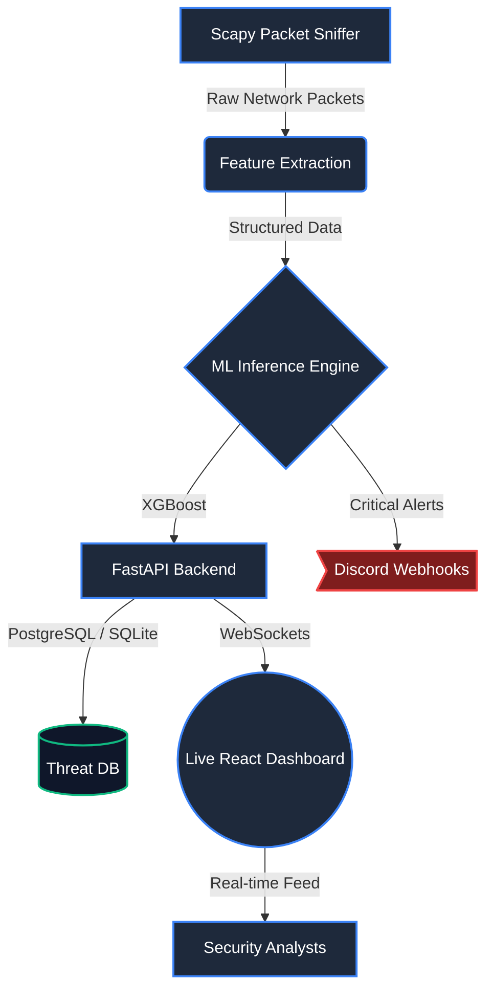

# 🛡️ NIDS Sentinel — Network Intrusion Detection System

> AI-Powered Real-Time Network Intrusion Detection and Threat Analysis

## ✨ Features

- **🔍 Real-Time Packet Sniffing** — Scapy-based network packet capture with live traffic analysis
- **🧠 AI-Powered Classification** — XGBoost classifier (99.97% accuracy, 96.8% macro F1 on deduplicated KDD Cup 99; see ML Model) detecting DoS, Probe, R2L and U2R attacks
- **📊 Live Dashboard** — Glassmorphic React dashboard with real-time traffic flow charts and threat monitoring
- **🚨 Threat Alerts** — Searchable/filterable alert system with block actions
- **🤖 AI Explainability** — Understand *why* the model flagged each threat (key features, severity, mitigation)
- **🌗 Light/Dark Mode** — Dynamic theme toggle with CSS variables
- **📈 Analytics** — Aggregated threat stats, top attacker IPs, attack type distribution

## 🏗️ Architecture



## 🛠️ Tech Stack

| Layer | Technology |
|-------|-----------|
| Frontend | Next.js 16, React, TypeScript, Tailwind CSS, Recharts, Framer Motion |
| Backend | FastAPI (Python), SQLAlchemy, WebSockets |
| Database | SQLite (PostgreSQL-ready) |
| ML Model | XGBoost, scikit-learn, Joblib |
| Sniffer | Scapy |
| Dataset | KDD Cup 99 (10%, via scikit-learn) for the reported metrics |

## 🚀 Quick Start

### 1. Backend
```bash
cd backend
python3 -m venv venv && source venv/bin/activate
pip install -r requirements.txt
uvicorn app.main:app --host 0.0.0.0 --port 8000 --reload
```

### 2. Frontend
```bash
cd frontend
npm install
npm run dev -- --port 3001
```

### 3. Start Traffic (Mock Mode)
```bash
cd sniffer
python3 -m venv venv && source venv/bin/activate
pip install -r requirements.txt
python mock_generator.py
```

### 4. Open Dashboard
Navigate to **http://localhost:3001**

## 📁 Project Structure

```
├── backend/          # FastAPI API + WebSocket server
├── frontend/         # Next.js dashboard + alerts UI
├── sniffer/          # Scapy packet capture + ML inference
├── ml-models/        # ML training pipeline
└── docs/             # Architecture, tasks, enhancements
```

## 📊 ML Model

- **Algorithm:** XGBoost classifier, 5 classes: Normal, DoS, Probe, R2L, U2R
- **Data:** KDD Cup 99 (10% set from `sklearn.datasets.fetch_kddcup99`), duplicates removed: 145,584 rows, stratified 80/20 split
- **Result (held-out 20%):** accuracy 99.97%, macro F1 96.84%. U2R is the weak class (F1 0.86, only 10 test samples), so look at macro F1 rather than accuracy.
- **Reproduce:** `cd ml-models/nids_training && python train_kdd99.py`
- **Caveat:** KDD Cup 99 is an old benchmark. Scores on it are optimistic compared with live traffic.
- **Live dashboard:** the demo runs on simulated traffic (`sniffer/mock_generator.py`) with a demo model trained on synthetic data (`backend/scripts/train_mega_2000_2026.py`). The numbers above come from the KDD Cup 99 benchmark, not from the demo model.
- **Built with:** the web app (FastAPI backend, Next.js frontend) was built with Claude Code.

## 📖 Documentation

- [Architecture & Design](docs/architecture.md)
- [Task Tracker](docs/task_tracker.md)
- [Future Enhancements](docs/enhancements.md)

## 📝 License

MIT License
