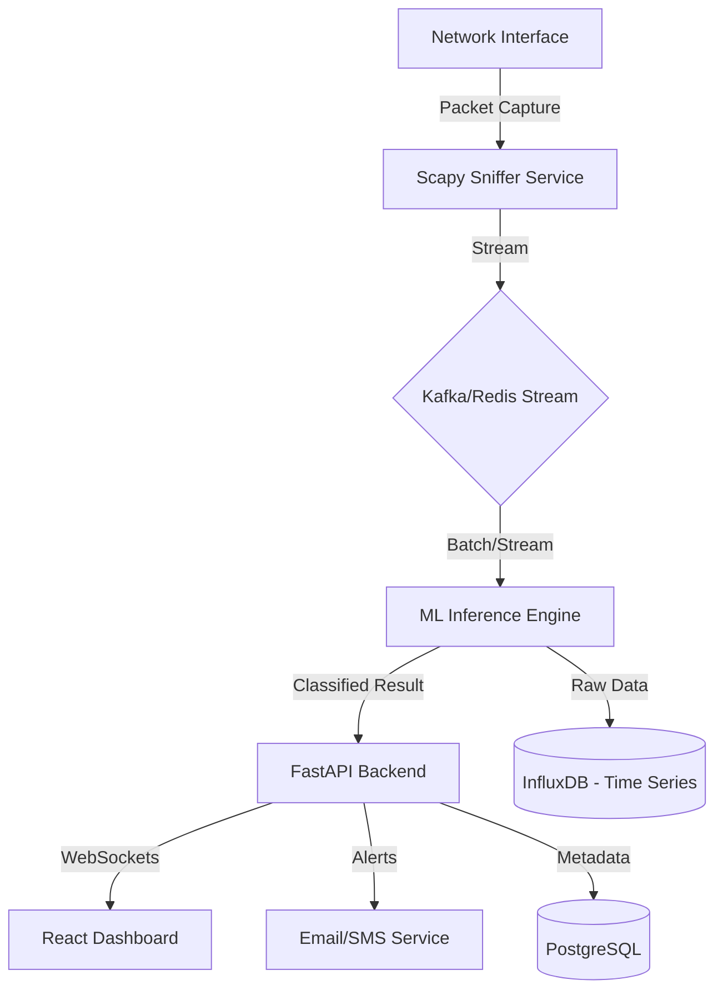

# Implementation Plan: Network Intrusion Detection System (NIDS)

## 1. Project Overview
The **Network Intrusion Detection System (NIDS)** is a high-performance cybersecurity tool that monitors network traffic in real-time. It uses Machine Learning to distinguish between normal traffic and various types of attacks (DDoS, Port Scanning, SQL Injection, etc.), providing immediate alerts through a web dashboard.

## 2. System Architecture
The system utilizes a producer-consumer model for real-time traffic analysis.

---

## 3. Feature Specification

### 3.1 Real-Time Monitoring
- **Packet Sniffing**: Live capture of TCP/UDP/ICMP packets using Scapy or PyShark.
- **Traffic Classification**: Identifying attack types (Normal, DoS, Probe, U2R, R2L).
- **Live Dashboard**: Visualizing flow rates, IP maps, and threat levels using Recharts.

### 3.2 Advanced Detection
- **Anomaly Detection**: Identifying unknown threats using Isolation Forest (unsupervised learning).
- **Pattern Matching**: Using LSTM to detect multi-stage attack patterns over time.
- **Severity Scoring**: Calculating a 0-100 risk score for every suspicious IP.

---

## 4. REST API & WebSocket Design
- `WS /ws/traffic`: Real-time stream of classified packet metadata to the frontend.
- `GET /stats/summary`: Daily/Hourly attack breakdown.
- `POST /settings/threshold`: Update sensitivity for anomaly detection.

---

## 5. Implementation Roadmap

### Phase 1: Foundation
- [ ] Set up project structure.
- [ ] Implement packet sniffing service with Scapy.
- [ ] Setup InfluxDB for logging time-series traffic data.

### Phase 2: AI & ML
- [ ] Train Random Forest on NSL-KDD / CICIDS datasets.
- [ ] Implement sequential feature extraction (Windowing) for LSTM.
- [ ] Create a standalone inference service.

### Phase 3: Dashboard & Alerts
- [ ] Build React dashboard with real-time charts.
- [ ] Establish WebSocket connection for live updates.
- [ ] Add Email/SMS alert notification system.

---

## 6. Technology Stack

| Layer | Technology |
| :--- | :--- |
| **Capture Layer** | Scapy, PyShark (Python) |
| **Backend** | FastAPI, WebSockets |
| **AI/ML** | Scikit-learn, PyTorch (LSTM), XGBoost |
| **Database** | InfluxDB (Traffic Logs), PostgreSQL (User Data) |
| **Frontend** | React, Recharts, Tailwind CSS |
| **Streaming** | Redis (as a lightweight message broker) |
| **DevOps** | Docker, Nginx |
